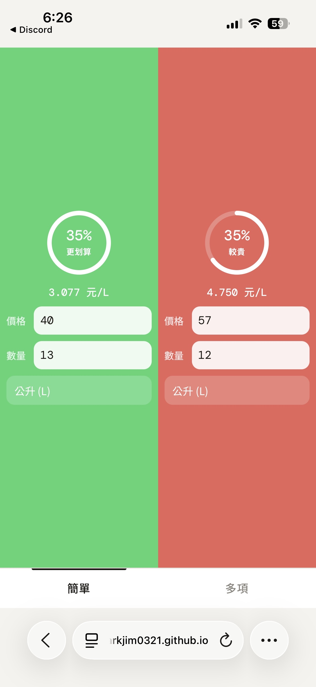

# Unit Price Comparison Tool

一個專為手機操作體驗設計的商品單價比較工具。  
透過簡潔的 UI 與即時計算功能，快速比較不同商品的單位價格，幫助使用者找到最划算的選擇。

---

## ✨ Features

### 🔹 Simple Compare Mode
- 雙商品即時比較
- 自動計算單位價格
- 視覺化圓形比較介面
- 自動標示較划算商品
- 支援不同單位：
  - 件／個
  - 克 (g)
  - 毫升 (ml)
  - 公斤 (kg)
  - 公升 (L)

### 🔹 Multi Compare Mode
- 多商品同時比較
- 自動單價排名
- 最佳價格高亮顯示
- 可新增／刪除商品
- 即時計算更新

---

## 📱 Responsive Design

本專案以手機使用體驗為核心進行設計，  
支援不同尺寸裝置，並針對行動裝置操作進行優化。

---

## 🛠 Built With

- HTML5
- CSS3
- Vanilla JavaScript
- Responsive Web Design (RWD)

> 本專案未使用任何前端框架，  
> 所有互動功能皆以原生 JavaScript 實作。

---

## 🚀 Getting Started

### 1. Clone Repository

```bash
git clone https://github.com/your-username/your-repository-name.git](https://github.com/markjim0321/Producd-price-comparison-tool.git
```

### 2. Open Project

直接開啟：

```bash
index.html
```

即可開始使用。

---

## 📸 Preview

### Simple Mode



### Multi Mode


> 可將截圖放入專案資料夾後替換圖片名稱。

---

## 📂 Project Structure

```bash
project/
│
├── index.html
├── README.md
├── preview-simple.png
└── preview-multi.png
```

---

## 🎯 Future Improvements

- LocalStorage 資料保存
- 深色模式（Dark Mode）
- PWA 支援
- 商品歷史紀錄
- 圖表分析功能
- 匯出比較結果

---

## 💡 Project Goal

希望透過簡單直觀的設計，  
讓使用者在購物時能更快速地進行價格分析與單價比較。

---

## 📄 License

This project is licensed under the MIT License.
